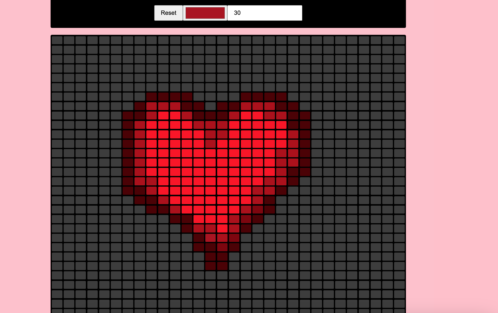

# This project is my Pixel Art Tool! 

### What my project is/does:
> I followed a tutorial to help me create a pixel art site! You can click or drag on the boxes, select different colors, and reset the canvas.
> Here's a screenshot!
> > 

### How you can view my project:
> Click here: https://zarazahed.github.io/pixel-art-project/

### Why I made my project:
> I've been experimenting with pixel art and wanted to try making a project about pixels myself.

### How I made my project:
> I used HTML, CSS, and JavaScript to make the site!

### What I struggled with and what I learned:
> I wrote my JS code with semicolons and didn't realize why my project wasn't working and almost quit. (Even though I was following a tutorial that clearly didn't have any.) I will admit that it was not my brightest moment.
> This was one of my first projects that involved more JS than other languages, so I learned a lot making this

#### Credits
> HUGE shout out to the creator of this tutorial: https://www.youtube.com/watch?v=wZZyhrJxZRU !!
